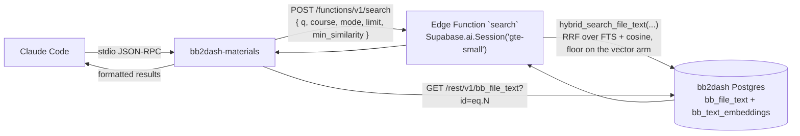

# bb2dash materials MCP server

stdio MCP server that lets Claude Code search the harvested class-materials corpus —
syllabi, lecture slides, readings, assignment specs and rosters for the Fall 2026 courses —
by meaning and by keyword, and read any unit in full.

Three read-only tools: **`search_materials`**, **`get_material_text`**, **`list_courses`**.

Live corpus: **64 files / 534 text units / 1,195 `gte-small` embeddings across 7 courses**
(100% of units embedded). Hybrid search answers in ~0.6 s warm, ~1.5 s after the Edge
Runtime has been idle.

---

## How it works — the client never embeds



The corpus was embedded **inside the Supabase Edge Runtime** with
`Supabase.ai.Session('gte-small')` (see `supabase/functions/embed-corpus`). The query must be
embedded by the same model with the same post-processing, or the cosine distances are
meaningless. So the query is embedded by the **same session in the same runtime**
(`supabase/functions/search`), and this process holds no model at all. Parity is guaranteed
by construction rather than verified after the fact — the opposite trade-off from the harness
`rag` server, which embeds locally and had to measure Node/Python agreement.

Ranked retrieval always goes through the SQL functions from migrations 010–012
(`search_file_text`, `match_file_text`, `hybrid_search_file_text`). Point reads (one unit, the
course list) go through PostgREST on `public`, which is exposed on this project.

### ⚠ There are two RAG stores. Never cross them.

|  | **bb2dash** (this server) | **harness-memory** (`rag` server) |
| --- | --- | --- |
| Project ref | `goultdzqcavefcgnifdy` | `hqkytnyiiuxovnnyixye` |
| Contents | Class materials | Session history by project/class |
| Model | `gte-small`, server-side | `bge-small-en-v1.5`, local fastembed |
| Dimensions | 384 | 384 |

Both are 384-dim, so pointing this server at the other project raises no error and returns
confidently-ranked nonsense. `loadConfig` refuses a `SUPABASE_URL` naming harness-memory.

---

## Setup

```powershell
cd C:/Users/estac/projects/bb2dash/mcp-server
npm install
npm run build
npm test
npm run smoke      # live end-to-end over stdio; reads ../.env, never prints the key
```

Requires Node ≥ 20.11 (developed on 24.13.0). Pass `C:/...` paths to Node, never MSYS `/c/...`.

### Environment

| Variable | Required | Default | Purpose |
| --- | --- | --- | --- |
| `SUPABASE_URL` | **yes** | — | `https://goultdzqcavefcgnifdy.supabase.co`. Refused if it names harness-memory. |
| `SUPABASE_SERVICE_ROLE` | **yes** | — | The `sb_secret_…` key. `SUPABASE_SERVICE_KEY` accepted as a legacy alias. |
| `BB2DASH_MIN_SIMILARITY` | no | `0.78` | Cosine floor on vector evidence. `none` disables. |
| `BB2DASH_DEFAULT_LIMIT` | no | `10` | `limit` when the caller omits it. |
| `BB2DASH_MAX_LIMIT` | no | `50` | Hard ceiling on `limit`. |
| `BB2DASH_TIMEOUT_MS` | no | `30000` | Per-request timeout. |

**Why the service key.** `bb_file_text` and `bb_text_embeddings` are readable only by
`authenticated`/service (anon is insert-only, by design — NOTES.md caveat 9), and `search` runs
behind `verify_jwt`. This is a local stdio process driven by Claude Code, never a browser, so the
key stays server-side; it lives in the server's env block in `~/.claude.json` and nowhere in the
repo.

### Register with Claude Code

MCP servers are **not** read from `~/.claude/settings.json`; user-scope servers live in
`~/.claude.json` and are written with the `claude mcp` CLI. Build the JSON from `.env` so the key
never appears on a command line:

```bash
JSON=$(node -e '
const env=Object.fromEntries(require("fs").readFileSync("C:/Users/estac/projects/bb2dash/.env","utf8").split(/\r?\n/)
  .filter(l=>/^[A-Z_]+=/.test(l)).map(l=>{const i=l.indexOf("=");return[l.slice(0,i),l.slice(i+1).trim()]}));
process.stdout.write(JSON.stringify({type:"stdio",command:"C:/Program Files/nodejs/node.exe",
  args:["C:/Users/estac/projects/bb2dash/mcp-server/dist/index.js"],
  env:{SUPABASE_URL:env.SUPABASE_URL,SUPABASE_SERVICE_ROLE:env.SUPABASE_SERVICE_ROLE}}))')
claude mcp add-json bb2dash "$JSON" -s user
claude mcp list        # bb2dash: ✔ Connected
```

After restarting Claude Code the tools appear as `mcp__bb2dash__search_materials`,
`mcp__bb2dash__get_material_text` and `mcp__bb2dash__list_courses`. Diagnostics go to stderr;
stdout is JSON-RPC only.

---

## Tools

### `search_materials`

| Parameter | Type | Required | Default | Notes |
| --- | --- | --- | --- | --- |
| `q` | string, 1–2000 chars | yes | — | Embedded server-side and passed verbatim to full-text search. |
| `course` | string | no | all | Exact course id from `list_courses`, e.g. `IST.323`. Case-sensitive. |
| `mode` | `hybrid` \| `vector` \| `fts` | no | `hybrid` | `vector` returns full unit text; `fts` is keyword-only with no similarity. |
| `limit` | integer 1–50 | no | 10 | |
| `min_similarity` | number 0–1 | no | 0.78 | Floor on the semantic evidence. Never gates literal keyword hits. |

**Example** (real output, trimmed):

```
3 results for "CIA triad confidentiality integrity availability" (all courses, mode hybrid, top 3).
Judge relevance by `similarity` — real cosine from gte-small, where on this corpus relevant
material scores ~0.83–0.92 and unrelated ~0.75–0.77. `score` is a Reciprocal Rank Fusion sum: it
sets the ordering and is not a percentage.

### 1. Lecture_1-PropertiesTrends-Fall2026.pptx
- course: IST.323
- bucket: lecture_slides
- unit: slide 3
- text_id: 400
- file_id: 7
- similarity: 0.9199
- score: 0.039216 (RRF, ordering only)

Information Security PropertiesThe CIA Triad …
```

#### Two scores, two meanings

- **`similarity`** is real cosine and is interpretable in absolute terms. Measured 2026-09-09
  over the live corpus (best hit, `mode=vector`):

  | Query class | Best-hit similarity |
  | --- | --- |
  | Relevant, 5 course-specific queries | 0.830 – 0.920 |
  | Nonsense English (bread, bike tire, football) | 0.753 – 0.767 |
  | Gibberish (`asdf qwerty zxcv`) | 0.818 — attracted to a roster spreadsheet |

  gte-small's range sits higher than bge's because every stored part carries a
  `{course} {bucket} — {file}: ` header. The **0.78** default clears every real-English nonsense
  hit and sits under every relevant one; gibberish is the known gap.
- **`score`** is a raw RRF sum with ceiling `2/(k+1) ≈ 0.039` at `k=50`. Ordering only.

#### An empty result is a valid answer

With the floor applied server-side, `"banana bread recipe with walnuts"` returns **nothing**,
and the message says so plainly with `isError` false. The floor gates the vector arm only: a unit
that matched the query terms literally still comes back, with its real similarity and a label
(`below the 0.78 floor — surfaced by literal keyword match`).

**Until the v3 `search` function is deployed**, the floor is not applied server-side; the server
says so in the result header and labels sub-floor hits rather than removing them. See "Deploying
the search function" below.

An empty result with a `course` filter lists the course ids that actually exist, because a
mistyped id (`IST323`) and an empty topic look identical otherwise.

#### Speaker notes

PPTX extraction inlines the professor's speaker notes behind a `[notes]` marker. Any excerpt or
unit containing it is flagged; treat that text as private instructor commentary, not slide
content.

### `get_material_text`

| Parameter | Type | Required |
| --- | --- | --- |
| `text_id` | positive integer, from a search result | yes |

Returns the full unit with file name, course, bucket, Blackboard path and character count. A
missing id is an empty result, not an error.

### `list_courses`

No arguments. Returns the seven course ids with short titles — the exact strings the `course`
filter accepts.

---

## Deploying the search function

`supabase/functions/search/index.ts` in this branch is **v3**: it accepts `min_similarity`,
forwards it to `hybrid_search_file_text` (migration 012, applied), filters `vector` results by it,
and echoes it in the response so the client knows the floor was applied. Omit the field and v3
behaves exactly like v2. The deployed function is still **v2** at the time of writing; deploy with

```powershell
supabase functions deploy search --project-ref goultdzqcavefcgnifdy
```

or through the Supabase MCP `deploy_edge_function` tool (`verify_jwt: true`, as today).

---

## Error handling

Every failure carries a `Fix:` line. Configuration problems are fatal at startup; everything else
is an MCP tool error the model can read.

| Situation | Behaviour |
| --- | --- |
| `SUPABASE_URL` / key missing | Exits 1 naming the variable. |
| `SUPABASE_URL` names harness-memory | Exits 1 — different vector space, would fail silently. |
| 401 / 403 | Tool error: the key must be the `sb_secret_…` service key. |
| 404 on `/functions/` | Tool error: deploy the `search` function. |
| 500 from the function | Tool error carrying the function's own message, code and hint. |
| Timeout | Tool error naming `BB2DASH_TIMEOUT_MS`. |
| Malformed row | Tool error — a schema drift never reaches the model as empty fields. |
| No results | **Not an error.** |
| Unit not found | **Not an error.** |

## Layout

```
mcp-server/
  src/
    index.ts                 stdio bootstrap, stderr logging
    server.ts                registers the three tools
    config.ts                env parsing, the two-stores guard, defaults
    client.ts                fetch wrapper: search Edge Function + PostgREST; row validation
    format.ts                LLM-readable rendering; similarity vs score labelling
    errors.ts                typed errors with actionable hints
    tools/
      schemas.ts             Zod input shapes
      search-materials.ts
      get-material-text.ts
      list-courses.ts
  test/                      vitest, fetch mocked — no network, no key
  scripts/smoke.mjs          live end-to-end over stdio
```

## Tests

```powershell
npm test                 # 66 tests
npm run test:coverage    # 95% statements, 82% branches, 100% functions
npm run typecheck
```

The retrieval-quality evaluation of FTS vs vector vs hybrid (ten known-answer questions) is in
`EVAL_EMBEDDING_POC.md` at the repo root.
